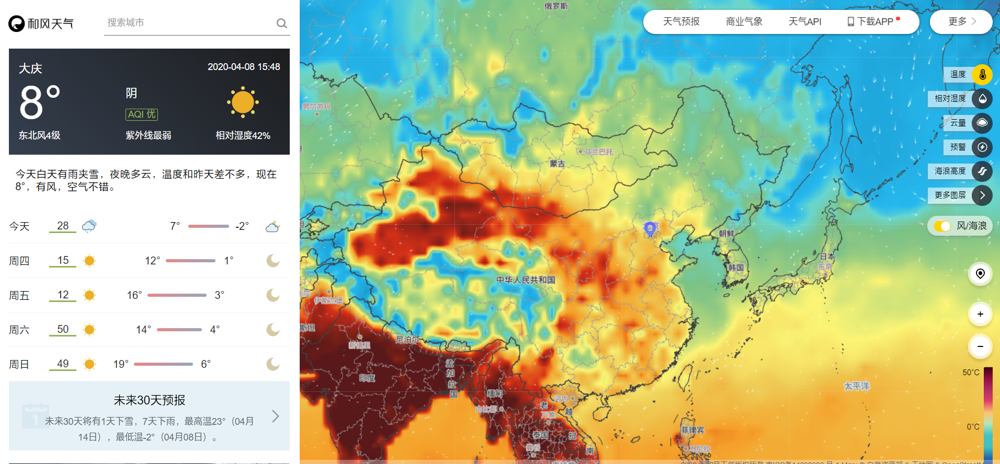
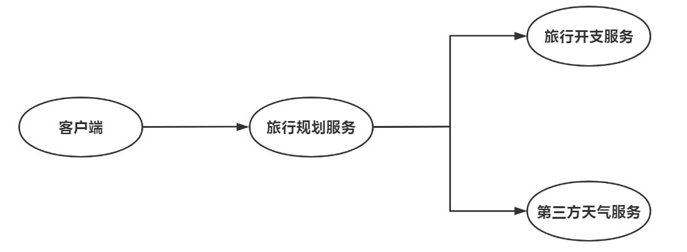
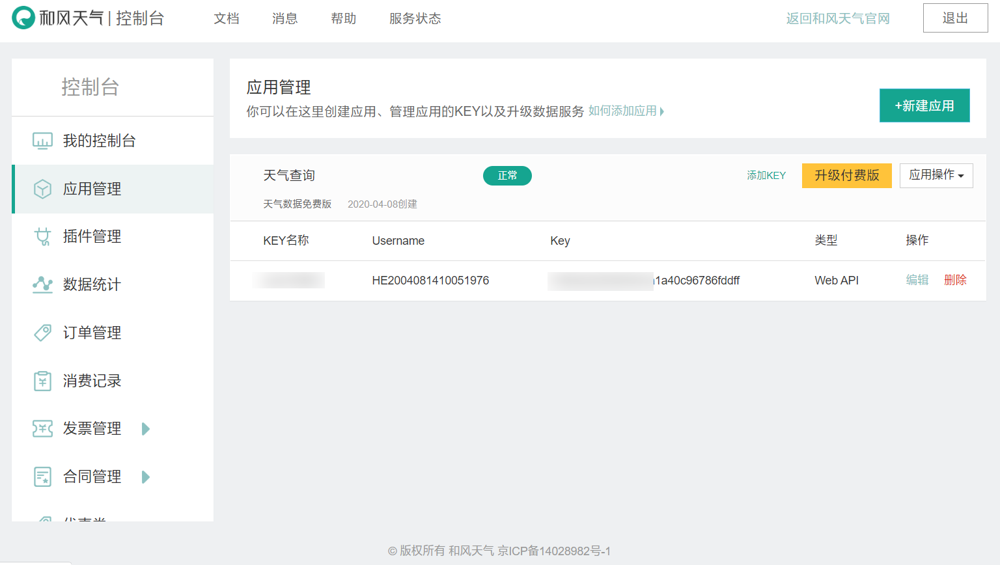
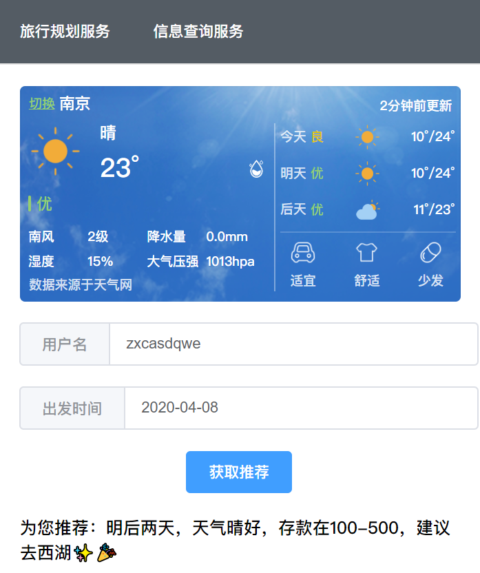
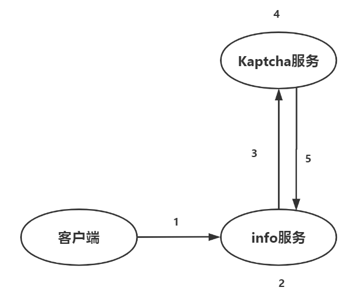
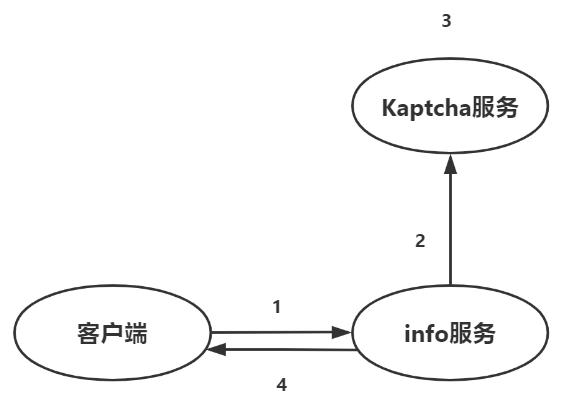
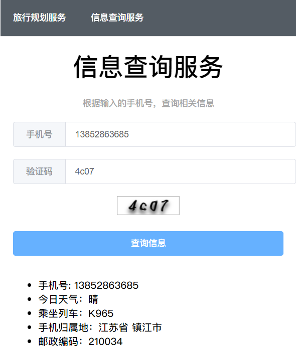

# 项目介绍

## 服务模块简介

### fwjsgl👔

（服务计算概论）此项目为**前端项目**，主要用于联调接口；

采用了：

1. Vue
2. Axios
3. Router
4. Element-UI

### expenditure

该服务用于查询个人账户余额

### journey

该服务会根据用户的账户信息以及天气情况，为用户安排合适的出行计划

使用了RestTemplate调用了以下服务：

1. 第三方天气服务，和风天气

   

2. expenditure，查询账户余额

### info

用于查询用户信息

调用了：

1. 验证码服务

### kaptcha

验证码服务，采用kaptcha生成4位图片验证码（具体验证码样式，可以在config中进行相应设置），需要引入Google的kaptcha包

# 注意😶

该项目最重要的部分即，**如何使将普通的服务对接验证码服务**

这里主要涉及到三个服务模块：

1. client前端
2. info模块
3. kaptcha模块

# 调用第三方API

## 模块组成

## 效果展示

# 如何对接验证码服务

## 初始化验证码系统

1. 当用户打开网页时，执行vue中amount操作，触发/init请求
2. info服务生成key
3. 将Key交给验证码服务端
4. 验证码端进行生成value和pic与key绑定
5. 验证码端返回pic给info服务
6. info服务返回给客户端key与pic的base64编码

## 验证过程

1. 客户端发送手机号，key，验证码
2. info服务端接收三项数据，将key和验证码发送给验证码服务验证
3. 验证码端接收到key与value，与static数据做比对，返回检验结果
4. 成功后返回成功数据

## 效果展示

